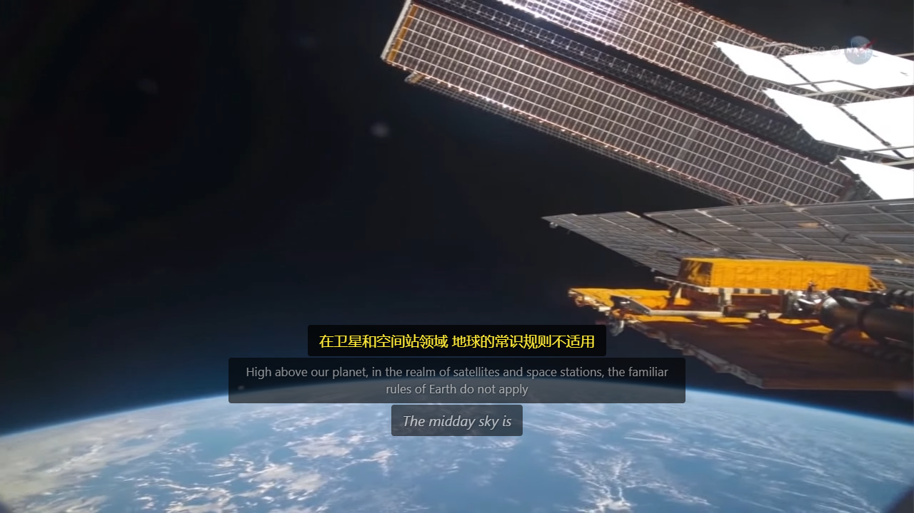
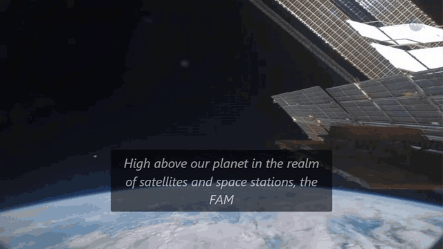

# whatchasay

[](https://github.com/SamJ12138/whatchasay/actions/workflows/ci.yml)

I built this for couples who do not share a first language, because my girlfriend
watches videos I cannot follow and I watch ones she cannot, and most of them either
have no subtitles or have subtitles that are wrong in ways that matter. whatchasay
listens to whatever is playing in a Chrome tab and lays live translated subtitles over
it, so the two of you can sit on the same couch, watch the same thing, and laugh at
the same moment instead of one person explaining the joke to the other afterwards.
It runs entirely on your own machine, and nothing you watch leaves your laptop unless
you decide it should.


*9 seconds of "10,000 রাজভোগের Order | Ora Char Jon | Movie Scene | Prosenjit | Abhishek Chatterjee | Debashree"
from the YouTube channel Bengali Movies with English Subtitle
(<https://www.youtube.com/watch?v=-tpVpbIxFmI>), run on CPU: Bengali speech detected and captioned live, each
sentence translated into English above it. Recorded by the browser harness during a live test
(`docs/live-test-youtube.md`), not by hand; the translations are as they came out, mistakes included.*

It is for videos and live streams that have no subtitles, lectures, and meetings held in a browser tab in a language
you do not speak. A Chrome extension captures the tab's sound, a local Python program turns English, Mandarin or
Bengali speech into text and translates it, and the extension draws both lines over the video, usually under a
second after each sentence ends. The extension only talks to the backend on 127.0.0.1, and nothing is sent to a
cloud service unless you turn a cloud provider on yourself (it is off by default).

## Requirements

| | |
|---|---|
| Operating system | **Windows 11: tested** (everything in this README). **Linux:** the backend's fast test suite and the extension tests run in CI on Ubuntu 24.04; the backend with real models and the browser extension have not been run on Linux. **macOS: untested.** |
| Python | 3.10 or newer (tested: 3.10 and 3.14 on Windows, 3.12 in CI on Windows and Ubuntu) |
| Browser | Desktop Chrome or Chromium 116 or newer (the extension uses an offscreen document and tab capture from its service worker). Tested with Google Chrome 153 (fresh profile) and Chromium 145. Other Chromium browsers: untested |
| CPU | Enough on its own. Measured on an Intel i9-13900H: speech recognition takes 2.5 ms per 40 ms of audio, translation 30-140 ms per sentence |
| Memory | The backend uses about 1 GB of RAM with English, Mandarin and Bengali loaded |
| GPU | Optional, only for the optional HY-MT translation engine (NVIDIA, 4 GB+) |
| Disk | 2.3 GB in all: Python packages 1.07 GB (`backend/venv`, CPU PyTorch included) and models 1.22 GB (`backend/data/models/`). Nothing is left in the Hugging Face cache |
| Network | Only for installing and downloading models. Running needs none |

## Quickstart

The commands are the same on every system except where PowerShell (Windows) and bash (Linux, macOS) differ. The
backend's virtual environment lives in `backend/venv`.

**1. Clone** (on Windows into a short path such as `C:\src`: pip fails on paths over 260 characters unless
Windows long paths are enabled)

```
git clone https://github.com/SamJ12138/whatchasay.git
cd whatchasay/backend
```

**2. Virtual environment and packages** (the CPU build of PyTorch is needed once, to convert the translation models;
about 1.5 minutes, 1.07 GB)

PowerShell:

```
python -m venv venv
venv\Scripts\python -m pip install -r requirements.txt
venv\Scripts\python -m pip install torch --index-url https://download.pytorch.org/whl/cpu
```

bash (on Debian and Ubuntu, `sudo apt install python3-venv` first):

```
python3 -m venv venv
venv/bin/python -m pip install -r requirements.txt
venv/bin/python -m pip install torch --index-url https://download.pytorch.org/whl/cpu
```

**3. Download the models** (2.3 GB: speech models 1.06 GB and OPUS-MT checkpoints 1.24 GB; each checkpoint is
converted to CTranslate2 once and then deleted. 231 seconds in our last measured run, 57 of them for OPUS-MT; it
depends mostly on how fast GitHub serves the speech models to you)

PowerShell: `venv\Scripts\python ..\scripts\download_models.py`

bash: `venv/bin/python ../scripts/download_models.py`

It prints each model as it goes and ends with `Done.`. Warnings about `HF_TOKEN` or `torch_dtype` along the way
are harmless. Everything it downloads has a declared permissive license (`NOTICE.md`).

**4. Start the backend** (leave it running)

PowerShell: `venv\Scripts\python run.py`

bash: `venv/bin/python run.py`

It listens on `http://127.0.0.1:8765` and is ready when it prints `Uvicorn running on http://127.0.0.1:8765` (about
5 seconds). `http://127.0.0.1:8765/health/json` shows the loaded engines; its `device` is `cpu`, or `cuda` if
CTranslate2 finds an NVIDIA GPU, which it then uses for OPUS-MT (`SUBTITLE_TRANSLATION__DEVICE=cpu` keeps it on the
CPU). Stop it with Ctrl+C.

**5. Load the extension**

1. Open `chrome://extensions`.
2. Turn on **Developer mode** (top right).
3. Click **Load unpacked** and choose the `extension` folder inside the clone.
4. Optional: click the puzzle-piece icon in the toolbar and pin **Multi-Language Subtitle Translator**.

The extension asks for no site access when it is installed.

**6. Get subtitles**

1. Open any video with speech in English, Mandarin or Bengali (a YouTube video without captions works) and let it
   play.
2. Click the extension's icon. Under *Live Captions*, choose the spoken language or leave *Auto-detect*.
3. Click **Start Live Captions**. The first time, Chrome asks to allow tab capture (Chrome words it as "Read and
   change all your data on all websites"); click **Allow**. The extension captures this tab's audio only, and you
   keep hearing it.

What you will see: the words in italics on a grey band while a sentence is being spoken, then the finished sentence with
casing and punctuation, with its translation above it in yellow. The default target languages are English and
Chinese; a language equal to the spoken one is skipped. With *Auto-detect*, what is recognised before the language
is known is a guess: it is drawn dimmed above a small *Detecting language…* label, and the first line at full
brightness is in the detected language.



*NASA ScienceCasts, "The Zero Gravity Coffee Cup" (public domain), running on CPU.*

Click **Stop Live Captions** in the popup, or press **Alt+L**, to stop.

## Using it

**Languages.** Speech: English, Mandarin Chinese (also English words inside Mandarin speech) and Bengali, with
automatic detection among the three. Translation targets offered: English, Chinese (Simplified), Bengali, Vietnamese,
Japanese, Korean, Spanish, French, German, Russian, Portuguese and Italian. With the default OPUS-MT engine every
one of them works from English, Mandarin and Bengali speech except Korean and Portuguese, which have no OPUS-MT
model from English; the Settings page greys them out ("no local model for en->ko") for the spoken language chosen
under *Live Captions*. They work with the optional HY-MT or cloud engines.
Directions without a direct model go through English (for example Mandarin to Bengali).

**Target languages.** Extension icon → **Settings** (bottom of the popup) → *Translation*: **Primary** and
**Secondary** language (Secondary can be *None*). Both are translated and shown together. **Alt+S** swaps their order.

**Caption mode** (videos that already have subtitles in another language). Off by default. *Settings → Caption Mode*
turns it on; Chrome then asks for access to the 14 supported video sites (YouTube, Netflix, Prime Video, Disney+,
HBO Max, Max, Twitch, yfsp.tv, Bilibili, iQIYI, Youku, v.qq.com, Viu, Abema), because the extension has to read
the subtitle text those pages show. Even then nothing is read until you switch on **Translate subtitles on this
tab** in the popup for a particular tab. Switching caption mode off gives the site access back.

**Corrections.** Press **Alt+E** while a translation is on screen, edit it, and press Enter (Escape cancels). The
subtitles hold still while you type. The correction is stored in the translation memory and used from the next
time the same sentence comes up, in live captions and in caption mode alike.

**What is remembered.** Live-caption text and its translations are kept in memory only until the session ends.
Page subtitles from caption mode and your corrections are kept in `backend/data/translation_memory.db`; machine
translations are deleted 30 days after their last use. *Settings → Data Management → Clear translation memory*
deletes everything in it (translations, corrections, glossary) and compacts the file.

**Keyboard shortcuts.** Alt+L start/stop live captions, Alt+T show/hide the overlay, Alt+S swap the two languages,
Alt+. larger font (the popup also has a smaller-font button), Alt+E edit the current translation. Change them at
`chrome://extensions/shortcuts`.

**When something does not work**

| What you see | What to do |
|---|---|
| "Failed: Cannot connect to the backend at ..." or "backend disconnected" in the popup | Is `run.py` still running? `http://127.0.0.1:8765/health/json` must answer |
| "Live captions need permission to capture this tab's audio" | Click **Start Live Captions** in the popup and allow it (Alt+L cannot ask; it opens the popup) |
| Start fails on a `chrome://` page or the Chrome Web Store | Chrome does not allow capturing those; use a normal web page |
| Captions but no translation | The target equals the spoken language, or it is greyed out in Settings (no route from that language) |
| "No audio reaching capture (DRM site or paused video)" | The video is paused, or the site protects its audio |
| Port 8765 is taken | `run.py --port 8766`, then set the server address in **Settings → Connection** |
| The backend log says a model is missing | Run step 3 again; it skips what is already there |
| pip fails with "No such file or directory" and a hint about long paths (Windows) | Clone into a shorter path (step 1), or enable Windows long paths |

## Optional extras

**HY-MT on an NVIDIA GPU.** Tencent's HY-MT1.5-1.8B translates every direction between 36 languages, Bengali
better than OPUS-MT, in 0.2-0.5 s per sentence on an RTX 4060 Laptop GPU. It is under the Tencent HY Community
License, which is not open source: among other terms it does not apply in, and the model must not be used in, the
European Union, the United Kingdom and South Korea. The download script shows the license summary and downloads
nothing until you accept it:

```
venv\Scripts\python -m pip install -r requirements-gpu.txt --extra-index-url https://download.pytorch.org/whl/cu128
venv\Scripts\python ..\scripts\download_models.py --hymt --accept-hymt-license
```

Then start the backend with `SUBTITLE_MT__ENGINE=hymt` (in `backend/.env`, see Configuration). The script fetches
the Windows CUDA build of llama.cpp's `llama-server`; on Linux, put a `llama-server` binary into
`backend/bin/llama/` yourself. If the GPU, the model or `llama-server` is missing, the backend says so in one line and
uses OPUS-MT.

**Cloud providers.** Off by default. With `SUBTITLE_CLOUD__ENABLED=true` and a key in `backend/.env` the backend
sends the subtitle text (never audio) to the provider you configure: Google Cloud Translation
(`translation.googleapis.com`) or Azure Translator for translation, and Groq or Gemini for the optional second-pass
refinement. Keys live only in `backend/.env`; the extension never stores or sends them. At startup the backend logs
which provider will receive text, and *Settings → Cloud Providers* shows the same line.

**The larger Mandarin model.** The default Mandarin model is Apache-2.0. A larger one with a lower error rate on read
Mandarin (CER 1.91 against 3.04 on AISHELL-1) declares no license at all and was trained on data that includes
WenetSpeech, which is released for non-commercial use. It is opt-in:
`download_models.py --mandarin-large` prints this notice and downloads nothing without
`--accept-mandarin-large-terms`; then set `SUBTITLE_ASR__ZH_MODEL=large`. Do not redistribute it.

## How it works



*12 seconds of NASA ScienceCasts, "The Zero Gravity Coffee Cup" (public domain): English speech captioned live,
words first, then each sentence cased and translated into Chinese. Speech recognition and translation ran on the
CPU of a laptop (Intel i9-13900H), no GPU and no cloud. Recorded by the browser harness, not by hand.*

```
 Chrome tab ──audio──> offscreen document ──16 kHz PCM, 40 ms frames──┐       (WebSocket, 127.0.0.1)
 (you keep hearing it)   (tab capture)                                  v
                                                    ┌─────────────── backend (Python) ───────────────┐
                                                    │ Zipformer streaming ASR (sherpa-onnx, CPU)     │
                                                    │   en / zh / bn, spoken-language ID (whisper-   │
                                                    │   tiny), partial words as you hear them        │
                                                    │ sentence end after 0.6 s of silence            │
                                                    │ English: casing + punctuation (CNN-BiLSTM)     │
                                                    │ OPUS-MT (CTranslate2 int8, CPU) per target,    │
                                                    │   via English when there is no direct model    │
                                                    └────────────────────────┬───────────────────────┘
 overlay on the video  <── content script <── service worker <──partial / final / translation──┘
```

Page subtitles (caption mode) take the other way in: the content script reads the cue, the service worker sends it
to the backend's `/ws`, and the translation comes back the same way. Details, and the mechanisms that are easy to
break (service-worker lifetime, site access, what is stored, cloud keys): `docs/architecture-notes.md`. Every stage
and its failure modes: `docs/pipeline-stages.md`.

**Measured latency** (run `20261002T110447-172f05`, Windows 11, i9-13900H, everything on CPU; clips streamed at
real-time pace by `backend/scripts/latency_report.py`):

| Clip | Speech | Sentences | Partial caption after its audio | Final after the last word | Translation after the final |
|---|---|---|---|---|---|
| NASA clip (this README's screenshot) | English, 32 s | 5 | under 0.01 s | 0.63 s | zh 44 ms, bn 100 ms |
| LibriSpeech sample (en model `test_wavs/1.wav`) | English, 18 s | 2 | under 0.01 s | 0.46 s | zh 51 ms, bn 121 ms |
| Mandarin sample (zh model `test_wavs/1.wav`) | Mandarin, 7 s | 2 | under 0.01 s | 0.63 s | en 27 ms, bn 82 ms |
| Code-switched sample (bilingual model `test_wavs/3.wav`) | Mandarin + English, 10 s | 1 | under 0.01 s | 0.62 s | en 35 ms, bn 85 ms |
| Bengali sample (bn model `test_wavs/1.wav`) | Bengali, 9 s | 1 | under 0.01 s | 0.62 s | en 51 ms, zh 142 ms |

"Final after the last word" is mostly the 0.6 s of silence the recognizer waits for before it closes a sentence.
Words also reach a partial caption with the recognizer's fixed look-ahead of a few hundred milliseconds, which this
table does not measure. The backend's run log for that run (`backend/logs/run_<run_id>.jsonl`, per-stage timings)
gives: speech recognition 2.5 ms per 40 ms frame, English punctuation 4.6 ms, translation 45 ms (p50).

Two findings from building it:

- **OPUS-MT ran on and on because the input lacked an end-of-sentence token.** Converted Marian models expect the
  source to end with `</s>`, which Hugging Face's tokenizer appends silently; without it the decoder kept going until
  the length cap, so the Bengali for "I'll be back" came out in English 27 times as long as the source, repeating
  itself. Adding `</s>` (and the `>>cmn_Hans<<` target token for English to Chinese) fixed it and halved the median
  translation time (66.6 ms to 30.4 ms); decoding settings had nothing to do with it.
- **A llama-server restart race silently fell back.** When the optional HY-MT engine's child process crashed, the next
  request could arrive after the process died but before Windows reaped it; it then waited two seconds for a refused
  connection and was answered by OPUS-MT, and that fallback was stored as a normal translation. Only the structured
  run log showed it (`docs/observations.md`, P2, run `run_20261001T213426-fe0c84`). The backend now restarts the child
  and retries once, within a bounded wait, before it falls back, and a fallback is marked as one and never stored in
  place of the real answer.

## Configuration

**In the extension:** the popup's **Settings** link opens the options page: languages, line layout and colours,
live-caption language and engine, caption mode, the optional refinement, and data management.

**In the backend:** environment variables, or the same names in `backend/.env` (copy `backend/.env.example`, which
lists all of them with their defaults; `.env` is ignored by git). Restart the backend after a change. Lists and
objects are JSON; relative paths are relative to `backend/`. Every setting:

**Translation engine**

| Variable | Default | |
|---|---|---|
| `SUBTITLE_MT__ENGINE` | `opus` | Translation engine: opus (OPUS-MT on CPU), hymt (HY-MT on an NVIDIA GPU, after `download_models.py --hymt --accept-hymt-license`) or cloud (Google/Azure) |
| `SUBTITLE_MT__ENGINE_ORDER` | `[]` | Router order; empty = [engine] with opus behind it as the fallback (cloud is appended when enabled) |
| `SUBTITLE_MT__HYMT_GGUF` | `data/models/mt/HY-MT1.5-1.8B-Q4_K_M.gguf` | HY-MT model file (Q4_K_M: 25-40% faster Bengali output than Q8_0, equivalent quality) |
| `SUBTITLE_MT__HYMT_REPO` | `tencent/HY-MT1.5-1.8B-GGUF` | Hugging Face repo the download script fetches the GGUF from |
| `SUBTITLE_MT__HYMT_GPU_LAYERS` | `-1` | Layers offloaded to the GPU (-1 = all) |
| `SUBTITLE_MT__HYMT_CTX` | `1024` | llama-server context size per slot |
| `SUBTITLE_MT__HYMT_MAX_TOKENS` | `96` | Maximum output tokens per HY-MT translation |
| `SUBTITLE_MT__HYMT_PARALLEL` | `2` | llama-server slots (two target languages decode together) |
| `SUBTITLE_MT__HYMT_HEALTH_TIMEOUT_S` | `120.0` | First start: seconds to wait for llama-server to load the model |
| `SUBTITLE_MT__HYMT_RESTART_TIMEOUT_S` | `20.0` | A request that finds llama-server dead waits at most this long for the restarted one |
| `SUBTITLE_MT__HYMT_WARMUP_ATTEMPTS` | `3` | Warmup attempts before HY-MT is paused |
| `SUBTITLE_MT__HYMT_WARMUP_BACKOFF_S` | `1.0` | Pause between warmup attempts (doubles each time) |
| `SUBTITLE_MT__HYMT_RETRY_INITIAL_S` | `15.0` | After a failed start HY-MT is skipped this long, then tried again |
| `SUBTITLE_MT__HYMT_RETRY_MAX_S` | `300.0` | Cap for that doubling pause |
| `SUBTITLE_MT__HYMT_LANGUAGES` | `["en", "zh", "bn", "vi", "ja", "ko", "es", "fr", "de", "r...]` | Target languages HY-MT is preferred for (others go to OPUS-MT) |

**Translation: languages, line layout, OPUS-MT**

| Variable | Default | |
|---|---|---|
| `SUBTITLE_TRANSLATION__TARGET_LANGUAGES` | `["en", "zh"]` | Default target languages (the extension usually sends its own per session) |
| `SUBTITLE_TRANSLATION__SUPPORTED_LANGUAGES` | `["en", "zh", "bn", "vi", "ja", "ko", "es", "fr", "de", "r...]` | Languages offered to the extension |
| `SUBTITLE_TRANSLATION__MAX_LINES` | `2` | Maximum lines per subtitle |
| `SUBTITLE_TRANSLATION__MAX_CHARS_BY_LANG` | `{"en": 42, "vi": 42, "es": 42, "fr": 42, "de": 40, "pt": ...` | Characters per line by language ("_default" for the rest) |
| `SUBTITLE_TRANSLATION__MAX_CHARS_EN` | `42` | Older English line limit, used when MAX_CHARS_BY_LANG has no entry |
| `SUBTITLE_TRANSLATION__MAX_CHARS_ZH` | `22` | Older Chinese/Japanese/Korean line limit, used when MAX_CHARS_BY_LANG has no entry |
| `SUBTITLE_TRANSLATION__MAX_CHARS_VI` | `42` | Older Vietnamese line limit, used when MAX_CHARS_BY_LANG has no entry |
| `SUBTITLE_TRANSLATION__MAX_CHARS_DEFAULT` | `40` | Line limit for other languages when MAX_CHARS_BY_LANG has no "_default" |
| `SUBTITLE_TRANSLATION__MAX_READING_SPEED_EN` | `25.0` | English reading-speed limit (characters per second) used by the line breaker |
| `SUBTITLE_TRANSLATION__MAX_READING_SPEED_ZH` | `15.0` | Chinese reading-speed limit (characters per second) used by the line breaker |
| `SUBTITLE_TRANSLATION__DEVICE` | `cpu` | OPUS-MT device: cuda or cpu; default cuda when an NVIDIA GPU is visible, else cpu |
| `SUBTITLE_TRANSLATION__OPUS_MODELS` | `{...}` | OPUS-MT model per direction: {"<src>": {"<tgt>": "<Hugging Face model>"}}; default: see backend/app/config.py |
| `SUBTITLE_TRANSLATION__ALLOW_PIVOT` | `true` | Translate X->en->Y when no direct OPUS-MT model exists |
| `SUBTITLE_TRANSLATION__CT2_DIR` | `data/models/ct2` | Where converted (CTranslate2) OPUS-MT models live |
| `SUBTITLE_TRANSLATION__OPUS_BEAM_SIZE` | `2` | OPUS-MT beam size |
| `SUBTITLE_TRANSLATION__OPUS_REPETITION_PENALTY` | `1.2` | OPUS-MT repetition penalty |
| `SUBTITLE_TRANSLATION__OPUS_NO_REPEAT_NGRAM_SIZE` | `2` | Never repeat an n-gram of this size (0 = off) |
| `SUBTITLE_TRANSLATION__OPUS_MAX_TOKENS` | `128` | Hard cap on output tokens |
| `SUBTITLE_TRANSLATION__OPUS_MAX_LENGTH_RATIO` | `3.0` | Output tokens <= ratio x source tokens + 4 (stops a runaway decode; 0 = only the hard cap) |
| `SUBTITLE_TRANSLATION__OPUS_TARGET_TOKENS` | `{"Helsinki-NLP/opus-mt-en-zh": ">>cmn_Hans<<", "Helsinki-...` | Target-language token for multi-target models |

**Language detection for page subtitles without a declared language**

| Variable | Default | |
|---|---|---|
| `SUBTITLE_LANG_DETECT__MIN_CHARS` | `24` | Shorter Latin-script text uses the session's language hint instead of a guess |
| `SUBTITLE_LANG_DETECT__CONFIDENCE_FLOOR` | `0.9` | Longer text takes the detector's answer only at or above this probability |
| `SUBTITLE_LANG_DETECT__CANDIDATE_LANGUAGES` | `["en", "zh", "bn", "vi", "ja", "ko", "es", "fr", "de", "r...]` | Languages the detector may answer with (others fall back to the hint) |
| `SUBTITLE_LANG_DETECT__DEFAULT_HINT` | `en` | Hint when neither the cue nor the tab declares a language |

**Speech recognition (live captions)**

| Variable | Default | |
|---|---|---|
| `SUBTITLE_ASR__ENGINE` | `auto` | Speech engine: auto or sherpa-zipformer (the only engine) |
| `SUBTITLE_ASR__MODELS_DIR` | `data/models/asr` | Where the speech models live |
| `SUBTITLE_ASR__ZH_MODEL` | `bilingual` | Mandarin model: bilingual (Apache-2.0, default) or large (no declared license, lower error rate on read Mandarin; `download_models.py --mandarin-large --accept-mandarin-large-terms`) |
| `SUBTITLE_ASR__PUNCTUATION` | `true` | Restore casing and punctuation of English speech before translation |
| `SUBTITLE_ASR__PUNCT_DIR` | `data/models/punct` | Where the punctuation model lives |
| `SUBTITLE_ASR__LANGUAGES` | `["en", "zh", "bn"]` | Spoken languages with streaming models (auto-detect chooses among these) |
| `SUBTITLE_ASR__NUM_THREADS` | `2` | CPU threads per recognizer |
| `SUBTITLE_ASR__RULE1_MIN_TRAILING_SILENCE` | `1.2` | Endpointing (seconds): reset after this much silence when no word was recognised yet |
| `SUBTITLE_ASR__RULE2_MIN_TRAILING_SILENCE` | `0.6` | End a sentence after this much silence following speech |
| `SUBTITLE_ASR__RULE3_MIN_UTTERANCE_LENGTH` | `10.0` | End it anyway after this long, even mid-sentence |
| `SUBTITLE_ASR__LID_WINDOW_S` | `2.5` | Seconds of voiced audio before spoken-language ID runs |
| `SUBTITLE_ASR__LID_MIN_CONFIDENCE` | `0.6` | Spoken-language ID answers only at or above this confidence among the spoken languages |
| `SUBTITLE_ASR__PARTIAL_INTERVAL_MS` | `120` | Minimum gap between partial captions (ms) |
| `SUBTITLE_ASR__WARMUP_LANGUAGES` | `["en", "zh", "bn"]` | Recognizers loaded at startup so a language switch is instant |

**Cloud providers (off by default; text leaves this computer when on)**

| Variable | Default | |
|---|---|---|
| `SUBTITLE_CLOUD__ENABLED` | `false` | Master switch for cloud translation and the Groq/Gemini refiners |
| `SUBTITLE_CLOUD__MT_PROVIDER` | `google` | Cloud translation provider: google or azure |
| `SUBTITLE_CLOUD__GOOGLE_API_KEY` | `(empty)` | Google Cloud Translation API key |
| `SUBTITLE_CLOUD__AZURE_TRANSLATOR_KEY` | `(empty)` | Azure Translator key |
| `SUBTITLE_CLOUD__AZURE_TRANSLATOR_REGION` | `(empty)` | Azure Translator region (e.g. westeurope) |

**Optional LLM refinement (a second, improved translation a moment later)**

| Variable | Default | |
|---|---|---|
| `SUBTITLE_REFINER__ENABLED` | `false` | Off by default; a tab can still ask for it in the extension's settings |
| `SUBTITLE_REFINER__PROVIDER` | `ollama` | Refiner: ollama (local), groq or gemini (cloud: also needs SUBTITLE_CLOUD__ENABLED=true) |
| `SUBTITLE_REFINER__DEADLINE_S` | `0.8` | A refinement later than this (seconds) is dropped |
| `SUBTITLE_REFINER__SKIP_LANGUAGES` | `["bn"]` | Target languages never refined (small LLMs degrade Bengali) |
| `SUBTITLE_REFINER__GROQ_API_KEY` | `(empty)` | Groq API key (refiner) |
| `SUBTITLE_REFINER__GROQ_MODEL` | `llama-3.1-8b-instant` | Groq model |
| `SUBTITLE_REFINER__GEMINI_API_KEY` | `(empty)` | Gemini API key (refiner) |
| `SUBTITLE_REFINER__GEMINI_MODEL` | `gemini-2.5-flash-lite` | Gemini model |
| `SUBTITLE_OLLAMA__BASE_URL` | `http://localhost:11434` | Local Ollama server for provider=ollama |
| `SUBTITLE_OLLAMA__MODEL` | `qwen3:4b` | Ollama model |
| `SUBTITLE_OLLAMA__TIMEOUT` | `30.0` | Seconds per Ollama request |
| `SUBTITLE_OLLAMA__CONTEXT_WINDOW_SIZE` | `3` | Previous subtitles given to the refiner as context |

**What is remembered**

| Variable | Default | |
|---|---|---|
| `SUBTITLE_TM__PERSIST_AUDIO_SESSIONS` | `false` | Live-caption (audio) sessions write to the translation memory (default: never) |
| `SUBTITLE_TM__PERSIST_CAPTIONS` | `true` | Page subtitles (caption mode) are kept in the translation memory |
| `SUBTITLE_TM__RETENTION_DAYS` | `30` | Machine translations unused this many days are deleted at startup (0 = keep; corrections are kept) |
| `SUBTITLE_CACHE__MEMORY_CACHE_SIZE` | `1000` | In-memory translation cache: entries |
| `SUBTITLE_CACHE__MEMORY_CACHE_TTL` | `3600` | In-memory translation cache: seconds an entry lives |
| `SUBTITLE_CACHE__TM_DATABASE_PATH` | `data/translation_memory.db` | The translation memory (SQLite) |
| `SUBTITLE_DATA_DIR` | `data` | Folder for runtime data |

**Server**

| Variable | Default | |
|---|---|---|
| `SUBTITLE_SERVER__HOST` | `127.0.0.1` | Bind address; loopback only, anything else is refused |
| `SUBTITLE_SERVER__PORT` | `8765` | Port (also run.py --port; the extension's server URL must match) |
| `SUBTITLE_SERVER__ALLOW_LOCAL_EXTENSION` | `true` | Accept the unpacked extension next to this backend (its id is derived from its folder) |
| `SUBTITLE_SERVER__EXTENSION_IDS` | `[]` | More extension ids allowed to call the backend |
| `SUBTITLE_SERVER__EXTRA_ORIGINS` | `[]` | More origins allowed to call the backend |
| `SUBTITLE_SERVER__DEBUG` | `false` | Debug logging (also run.py --debug) |
| `SUBTITLE_SERVER__WS_PING_INTERVAL` | `30.0` | WebSocket keepalive ping interval (seconds) |
| `SUBTITLE_SERVER__WS_PING_TIMEOUT` | `10.0` | WebSocket keepalive ping timeout (seconds) |
| `SUBTITLE_SERVER__MAX_CONCURRENT_TRANSLATIONS` | `5` | Translations running at once |

**Behaviour flags**

| Variable | Default | |
|---|---|---|
| `SUBTITLE_FEATURES__USE_POST_EDITOR` | `false` | Older name for SUBTITLE_REFINER__ENABLED (either one turns refinement on) |
| `SUBTITLE_FEATURES__FAST_MODE` | `true` | Session default for the extension's fast mode |
| `SUBTITLE_FEATURES__STRICT_MEANING_LOCK` | `true` | Session default for the extension's strict meaning lock |
| `SUBTITLE_FEATURES__WARMUP_ON_START` | `true` | Load models at startup (off: they load on first use) |
| `SUBTITLE_FEATURES__BATCH_WINDOW_MS` | `30` | Page-subtitle cues arriving within this many ms are translated in one batch |
| `SUBTITLE_FEATURES__MAX_BATCH_SIZE` | `8` | Most cues in one such batch |

## Development

Tests, from `backend/` (install the test tools once: `venv\Scripts\python -m pip install -r requirements-dev.txt`):

| Suite | Command (PowerShell; bash: `venv/bin/python`) | What it needs | Time |
|---|---|---|---|
| Fast | `venv\Scripts\python -m pytest` | nothing: fake MT and ASR engines (`tests/fakes.py`), a fake llama-server (`tests/fake_llama_server.py`), the real app in-process, scratch data paths | ~30 s |
| Slow | `venv\Scripts\python -m pytest -m slow` | the downloaded models, and for the browser tests a Python with Playwright (`pip install playwright`, `playwright install chromium`) named in `ST_PLAYWRIGHT_PYTHON` | ~4 min |
| Extension | `cd ..\extension` then `node --test` | Node 22 | ~1 s |

**Pre-commit hook.** Run `python scripts/install-hooks.py` once per clone. From then on every `git commit` runs
`scripts/hooks/pre-commit`: the fast suite and the extension tests, and a red result refuses the commit (it tests the
files as they are on disk, so stage everything you changed). It needs `backend/venv` with `requirements-dev.txt` and
Node on PATH.

The fast suite never touches `backend/data/`; the slow tests read models from `backend/data/models` or from
`ST_MODELS_ROOT`.

**Browser harness.** `backend/scripts/e2e_extension.py` loads the unpacked extension into Chromium with
Playwright and drives one path end to end: `--path audio` (a page plays a sample and live captions must deliver a
translated cue to the page), `captions`, `security`, `sw-idle` (Chrome's real 30 s service-worker idle timeout,
driven over raw CDP because Playwright keeps workers alive), `permissions`, `clear-memory`, `cloud-keys`. Add
`--start-backend` to start a backend with scratch data. `--video FILE --record DIR --screenshot FILE` produce the
demo and the screenshot in this README. `--url URL --targets auto --lines 5` live-captions a real page's video
(`docs/live-test-youtube.md`); it stops with exit code 2 on a consent wall or bot check instead of getting past it.

**Run logs and the failure report.** Every backend run writes one JSON line per event to
`backend/logs/run_<run_id>.jsonl` (stage, event, duration, error type; the extension's events arrive through
`POST /obs`; subtitle text is never logged, only lengths). `/health/json` names the current `run_id`.
`venv\Scripts\python scripts\failure_report.py logs\run_<run_id>.jsonl` summarises a run: failures by stage and
error type, per-stage p50/p95, per-session totals. The stage names are in `docs/pipeline-stages.md`; known swallowed
and degraded paths are in `docs/observations.md`.

**Other scripts:** `backend/scripts/make_demo_gif.py` (the demo GIF and screenshot above, from a recorded live
run), `backend/scripts/latency_report.py` (the latency table above), `backend/scripts/opus_quality.py`
(OPUS-MT output and speed over the six en/zh/bn directions), `backend/scripts/asr_input_quality.py`
(`docs/asr-input-quality.md`), `backend/scripts/clean_install_check.py` (fresh venv from the requirements files, then
the fast suite), `scripts/check_large_files.py` (nothing large or binary gets committed).

CI ([runs](https://github.com/SamJ12138/whatchasay/actions/workflows/ci.yml)): the fast suite with coverage, the extension tests and the clean-install check on Ubuntu and
Windows (`.github/workflows/ci.yml`). `DEVLOG.md` is the project history; every change appends to its change log.

## Status and limitations

- Tested end to end on Windows 11 only. Linux runs the fast and extension tests in CI; macOS is untested.
- Speech recognition covers English, Mandarin and Bengali only. Bengali recognition is the weakest of the three (the
  Bengali model's word error rate is about 18-21 %), and Bengali names come out misspelled.
- Translation quality per direction (OPUS-MT, from `docs/asr-input-quality.md` and the Phase 2b checks): English to
  Chinese and Mandarin to English keep the meaning of ordinary sentences but read stiffly; English to Bengali is
  usable; literary or long sentences lose clauses; Mandarin to Bengali and Bengali to Chinese go through English and
  can drop a clause. HY-MT (GPU) is better for Bengali.
- Without the English punctuation model (if it is missing) English speech is translated in upper case, which OPUS-MT
  handles badly. The bilingual Mandarin model writes English words inside Mandarin speech in upper case, and they
  are not restored.
- A sentence longer than 10 seconds of continuous speech is cut and its parts are translated separately.
- With *Auto-detect*, the first seconds (about 5 in the YouTube live test) are recognised as English until detection
  has heard enough. That text is dimmed under *Detecting language…* and thrown away if the language turns out to be
  another one; choosing the spoken language avoids the wait.
- Spoken-language detection (whisper-tiny) is unreliable on Bengali: on its own it often takes Bengali for Hindi or
  Nepali. The backend now picks the likeliest of English, Mandarin and Bengali, and stays on its first guess when
  that is not clear enough: the captions then stay dimmed under *Language not detected, assuming English*. Set the
  spoken language under *Live Captions* in the popup instead of *Auto-detect*.
- Korean and Portuguese targets stay untranslated with OPUS-MT (no model from English).
- Sites that protect their audio (DRM) give silence; the popup then says no audio is reaching the capture.
- Chrome's built-in on-device translator (Chrome 138+, *Prepare on-device translation* in the popup) is wired in but
  has not been measured.
- HY-MT's `llama-server` is downloaded for Windows only.

## License

The code is under the MIT License (`LICENSE`). The models the scripts download are not part of this repository and
keep their own licenses, listed in `NOTICE.md`: OPUS-MT models (Apache-2.0, one CC-BY-4.0 with attribution),
sherpa-onnx and its speech models (Apache-2.0), Whisper tiny (MIT), and the optional HY-MT model (Tencent HY
Community License) and Mandarin model (no license declared).
