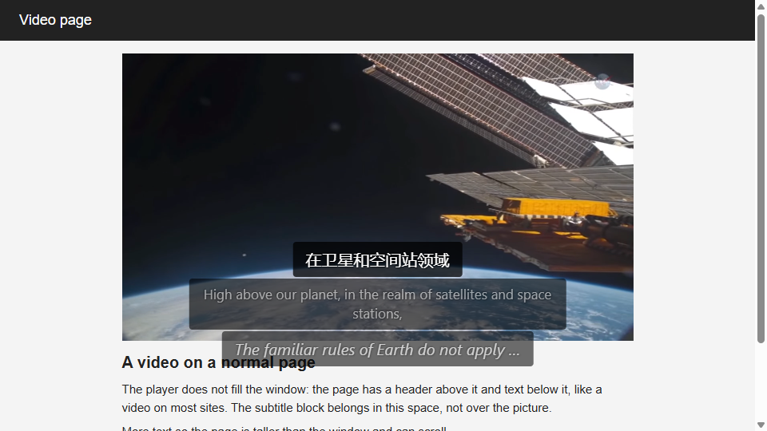
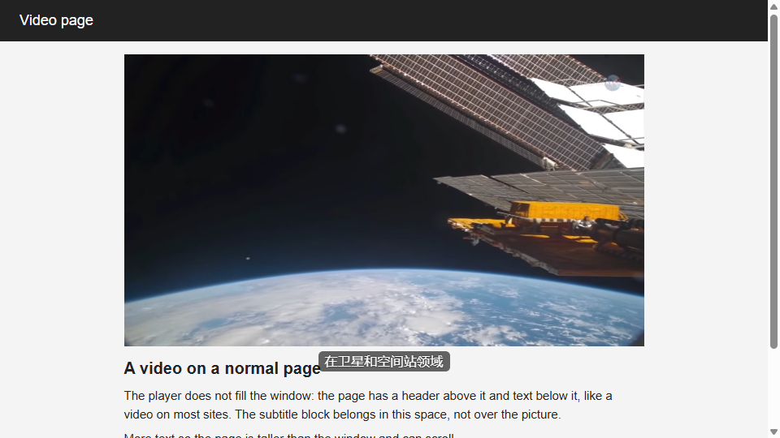
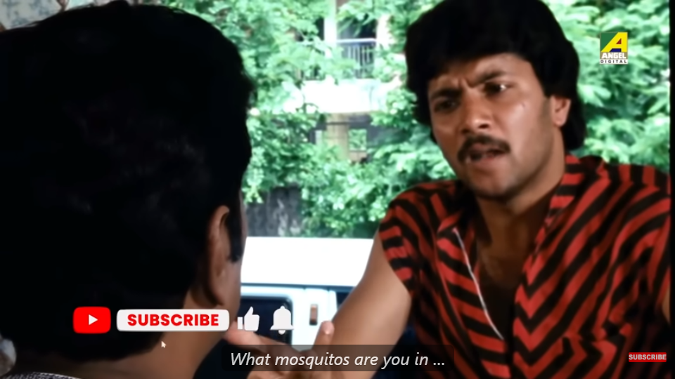

# The overlay: how much of the video it covers, and where it sits

The subtitle overlay (the source line plus the translation line) covered too much of the video, and streaming
partials made the source line grow while playing. This folder holds the screenshots and the numbers before and
after the overlay work (2026-10-02).

## How it is measured

`backend/scripts/e2e_extension.py --geometry` (with `--shots DIR --shot-name NAME`) runs the real extension in
Chromium and, every 250 ms while captions run, reads the overlay through its closed shadow root with CDP box
models: every subtitle line's border box, the subtitle block's box, and the video element's rectangle.
**Coverage** is the part of the video's area under the caption lines' boxes (the union of the boxes, clipped to
the video; notices and the language label are not counted). Three moments get a screenshot each, the first sample
that qualifies:

| Moment | What qualifies |
|---|---|
| idle | the first sample at least 0.3 s after the video started to play (nothing recognised yet, or the first dimmed words) |
| partial | a line in progress (the source line still being recognised, or a draft translation) of at least 20 characters, with no final translation on screen |
| final | the first final translation on screen (with the source line, when it is on) |

The coverage of each moment is read again right after its screenshot, so the number is what the picture shows.
"Max" is the largest coverage seen in any sample of the run.

Two clips, two layouts each, 960x540 viewport, everything on the CPU:

- **NASA clip** (`make_demo_gif.py`'s public-domain ScienceCasts excerpt, English speech, target Chinese, spoken
  language set to English): the harness's own pages. *Fullscreen* = `--layout fill`, the video fills the viewport,
  as it does in fullscreen. *Normal* = `--layout page`, a 640x360 player in a page column with a header above and
  text below, as on most sites.
- **YouTube** (the live test's film scene, `docs/live-test-youtube.md`, Bengali speech, Auto-detect, target
  English; `--url`, headful): *Normal* = the watch page as it opens; *Fullscreen* = the player put into fullscreen
  with YouTube's `f` key (`--fullscreen`; `document.fullscreenElement` set).

## Before (commit `f7e93d1`)

The overlay was a column of full-width bars fixed at 15 % from the bottom of the *viewport*, whatever the video's
size and place: on a normal page it sat over the lower part of the picture and spilled onto the page below it, and
the source line (the recognizer's partial result) was a bar that grew with every word.

| Clip, layout | run_id | idle | partial | final | max in the run | Screenshots |
|---|---|---|---|---|---|---|
| NASA, fullscreen | `20261002T183246-f424d5` | 0.0 % | 2.8 % | 11.0 % | 20.1 % | `before-nasa-fullscreen-{idle,partial,final}.png` |
| NASA, normal | `20261002T183346-90c440` | 0.0 % | 6.4 % | 19.1 % | 38.1 % | `before-nasa-normal-*.png` |
| YouTube, normal | `20261002T183439-177a62` | 0.0 % | 3.9 % | 7.0 % | 36.5 % | `before-youtube-normal-*.png` |
| YouTube, fullscreen | `20261002T183534-8742a0` | 0.8 % | 1.9 % | 3.3 % | 18.7 % | `before-youtube-fullscreen-*.png` |

Placement, before: in all four runs the block intersected the video in every sample that had a line (95 of 95
on the YouTube page, 95 of 95 on the NASA page), and was never inside the bottom 15 % of the video in the
fullscreen runs (0 of 93 and 0 of 95 samples): it was fixed at 15 % of the *viewport*, so in fullscreen it floated
above the bottom 15 % band, and on a normal page it hung below the player.

## After (the overlay batches, commits `f0600be`, `2b70045`, `94afd11`)

What changed, in the order the batches made it:

1. **Show less.** The translation only, by default; the source line (the spoken words) is off, and the popup's
   toggle *Show the spoken words under the translation* or **Alt+O** on the page turns it on (remembered,
   `showOriginal`). On, it is 0.8x the translation's font and at 0.7 opacity. Every line is at most 2 rows of 42
   characters (CJK: 22); a longer text keeps its newest words with an ellipsis at the start. The font is 4.5 % of
   the video element's height (`fontScalePct`), never under 14 px (`fontMinPx`). The background is a rounded box
   behind the text only (`overlayBgOpacity` 0.6), not a bar across the picture.
2. **Where the video is not.** When the video does not fill the viewport (under 95 % of its width or 90 % of its
   height, not fullscreen) the block sits directly below the video's bottom edge, in the page's space; fullscreen,
   or a video that fills the viewport, or no room below: over the video's bottom with a margin of 2 % of its height,
   and above the site's control bar while that is showing (YouTube's `.ytp-chrome-bottom` by name, any other
   site's by its place: a visible element anchored at the video's bottom edge, wider than half the video and under
   30 % of its height). The block can be dragged; the offset is remembered per site origin and placement mode.
   The block held one text per role, the newest (superseded by the rolling rows below): the previous stacking of
   the last line, the next line's draft and its partial (up to six rows) went, which kept the block at two rows.
3. **No jumping.** The stack reserves its height (two rows per configured translation role, two rows of the smaller
   font when the source line is on), and partial text is updated in the same element, so the block's box does not
   change while a line streams.

Same clips, layouts, viewport and moments as before; the defaults (source line off), except the last row:

| Clip, layout | run_id | idle | partial | final | max in the run | Block against the video | Screenshots |
|---|---|---|---|---|---|---|---|
| NASA, fullscreen | `20261002T192153-7ccd10` | 0.0 % | 1.8 % | 1.8 % | 6.8 % | over its bottom, inside the bottom 15 % in 94 of 94 samples | `after-nasa-fullscreen-*.png` |
| NASA, normal | `20261002T192235-1c0c81` | 0.0 % | 0.0 % | 0.0 % | 0.0 % | below it in 96 of 96 samples, never intersecting | `after-nasa-normal-*.png` |
| YouTube, normal | `20261002T192324-2bc1df` | 0.0 % | 0.0 % | 0.0 % | 0.0 % | below it in 95 of 95 samples, never intersecting | `after-youtube-normal-*.png` |
| YouTube, fullscreen | `20261002T192408-295079` | 0.0 % | 2.4 % | 1.9 % | 6.2 % | inside the bottom 15 % in 93 of 93 samples | `after-youtube-fullscreen-*.png` |
| NASA, fullscreen, source line on | `20261002T192916-62a7be` | 0.0 % | 2.1 % | 3.9 % | 10.7 % | over its bottom; four rows reserved, so above the 15 % band | `after-nasa-fullscreen-source-*.png` |

Before and after, the final moment / the largest coverage in the run:

| Clip, layout | Before | After (defaults) |
|---|---|---|
| NASA, fullscreen | 11.0 % / 20.1 % | 1.8 % / 6.8 % |
| NASA, normal page | 19.1 % / 38.1 % | 0 / 0 (below the video) |
| YouTube, normal page | 7.0 % / 36.5 % | 0 / 0 (below the video) |
| YouTube, fullscreen | 3.3 % / 18.7 % | 1.9 % / 6.2 % |

The "max" figures before were the moments when three bars were up (the last line's translation and source, the
next line's partial); after, the largest is a two-row draft. With the source line on in fullscreen the final
moment is 3.9 % (11.0 % before).

**Holding still.** With the source line on (the line in progress is rewritten at every partial result) the
block's box was read at each partial-text change, polled every 40 ms: the harness page with the looping English
sample, 50 consecutive updates, one block height, 0 position changes; the live clip on the YouTube page (run
`20261002T191908-5c5f3f`), 49 updates over 44 s (then music), one height (89 px), 0 position changes.

**Controls.** With the harness page's control bar showing (`--hover-controls`, the mouse kept over the player)
the lines never overlapped it in 91 samples (run `20261002T185836-c89f51`); on YouTube in fullscreen with the
bar showing, 0 overlaps in 74 samples and the block still inside the bottom 15 % (`20261002T190628-ccbc91`).

**Tests.** Layout math and the overlay's rules under node: `extension/tests/overlay-layout.test.js`,
`overlay-placement.test.js`, `overlay-stable.test.js`. In the browser (slow, `backend/tests/test_overlay_browser.py`):
below the video and never over it on the page layout; inside the bottom 15 % when it fills the viewport; clear of
the control bar; one height and no moves across 50 partial updates; the YouTube page behind `ST_YOUTUBE_URL`.

**Settings added** (extension, `chrome.storage.local.settings`; Options → Display):

| Key | Default | |
|---|---|---|
| `showOriginal` | `false` | the source line under the translation (popup toggle, Alt+O); was `true` |
| `fontScalePct` | `4.5` | font size as a percentage of the video element's height |
| `fontMinPx` | `14` | the smallest font, for small embeds |
| `overlayBgOpacity` | `0.6` | the rounded box behind each line |
| `fontSize` | `20` | (existing) px, now only while no video element is known |
| `maxLines`, `maxCharsLatin`, `maxCharsCJK` | `2`, `42`, `22` | (existing) now also the overlay's own cap per line |
| `overlayOffsets` (own key) | `{}` | dragged offsets: `{origin: {page: {dx, dy}, overlay: {dx, dy}}}` |

**Reproducing.** `backend/scripts/e2e_extension.py --start-backend --path audio --video CLIP --source en --targets zh
--prime-audio --size 960x540 --hold 20 --layout page|fill --geometry --shots docs/overlay --shot-name NAME`, and
`--url URL --source auto --targets auto --headful [--fullscreen]` for the YouTube page; `--show-source`,
`--hover-controls`, `--partial-updates 50` as above. The NASA clip is the one `make_demo_gif.py` downloads.

## Rolling two rows (commit after `e4f1710`)

The one-text-per-role rule gave the viewer too little time: on the live clip a final translation was on screen
for as little as **0.51 s** (minimum over 13 lines, p50 1.82 s, run `20261002T194945-ea5b15`, fullscreen,
sampled every 40 ms) before the next line's first draft replaced it; 8 of 13 lines were under the reading rule
below.

**The layout** (`lib/overlay-rows.js`, a pure state machine with an explicit clock): row 1 holds the previous
line's final translation, row 2 the current line's draft (or its final, briefly). When the current line is
finalised it moves to row 1 and row 2 clears for the next draft. A final stays at least
**max(1.5 s, characters / 15 per s)** (`minDisplayS`, `readCharsPerS`; characters = the row's text as drawn) before
it can be pushed out of row 1; if the next line finalises sooner, row 1 is held and row 2 shows the newer final
until the hold ends, and a draft of the line after that waits until row 2 is free. Fast speech (a third final
inside one hold) pushes the oldest line out early: the newest line is always on screen. The source line, when on,
is a third dimmer row for the current line only (the words being recognised, else the current line's words).
Each row is **one visual row** (`rowsPerLine` 1): a longer text keeps its newest words with an ellipsis at the
start, so the block stays two rows of the translation font (line-height 1.2, padding 0.1 em) plus a 1.2 % margin
in fullscreen: 71 px of a 540 px video, inside the bottom 15 %. The stack is a CSS grid of fixed rows
(`row-1-primary`, `row-2-primary`, `row-1-secondary`…, `row-source`), so the block's height is still constant;
`main.js` no longer drops the previous cue at a final (the overlay keeps up to 8 and bounds them itself).

**Measured on the live clip** (YouTube page, fullscreen, defaults, `--display-times`: each final translation's
first to last sighting at 40 ms polling, the line still up at the end excluded):

| | run_id | Final lines | Shortest on screen | p50 | Under the rule |
|---|---|---|---|---|---|
| Before (one text per role) | `20261002T194945-ea5b15` | 13 | **0.51 s** | 1.82 s | 8 of 13 |
| After (rolling rows) | `20261002T200253-469a90` | 10 | **2.52 s** | 4.80 s | 0 of 10 |

Same run, after: the block inside the bottom 15 % in 940 of 940 samples, one block height (71 px) across the run,
0 position changes, largest coverage 6.2 % (the two rows both filled). Node tests `extension/tests/overlay-rows.test.js`
(the machine on scripted sequences of partials and finals, fast speech included; the overlay drawing the rows);
browser tests as before (`tests/test_overlay_browser.py`).

**Settings added:** `minDisplayS` 1.5, `readCharsPerS` 15, `rowsPerLine` 1 (overlay settings, not in Options).

